## Contents
- [Unit Testing](#unit-testing)

- [Validator Testing](#validator-testing)
    - [Lighthouse Test](#lighthouse-test)
    - [W3C Markup Validation](#w3c-markup-validation)
    - [W3C CSS Validation](#w3c-css-validation)
    - [PEP8 validation](#pep8-validaton)
- [User Story Testing](#user-story-testing)
    - [Admin](#admin)
    - [General User](#general-user)
    - [Member User](#member-user)
- [Final testing](#final-testing)

## Unit Testing

- I have used Django TestCase for automated testing for Views, and form files

## Manual Testing

    - I have manually tested each page all the posts logins and logouts work as expected. Ran out of time to up load images

## Validator Testing

### Lighthouse Test

- Lighthouse result for desktop
    - The 89 is around image rendering and is out of my abilities at this time.

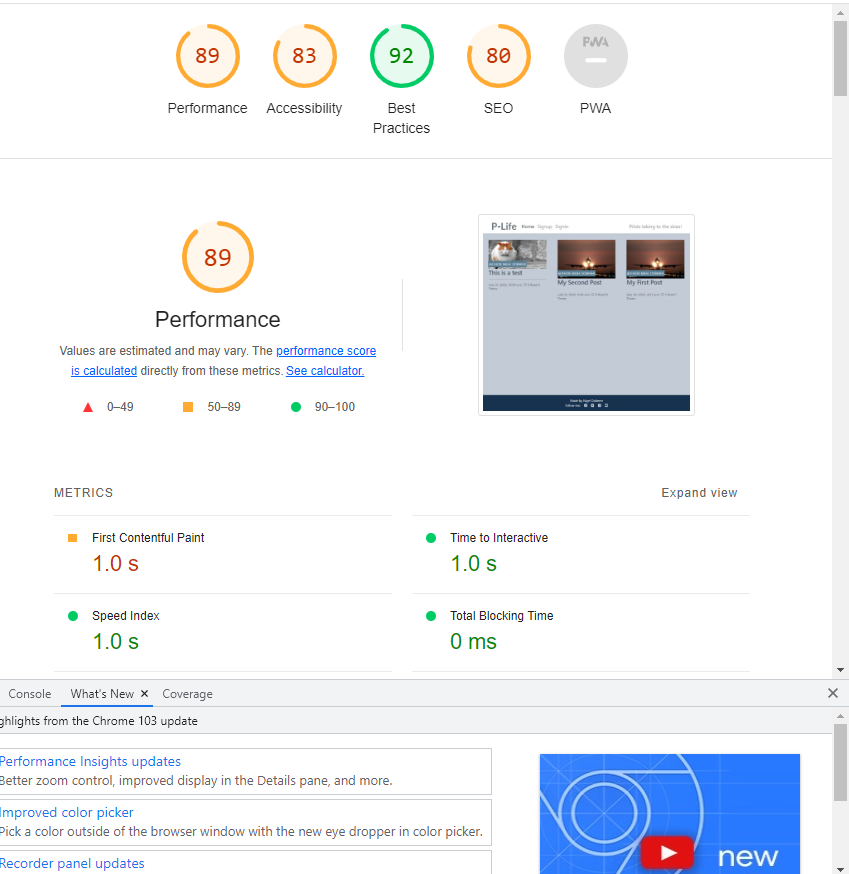

- Lighthouse result for mobile

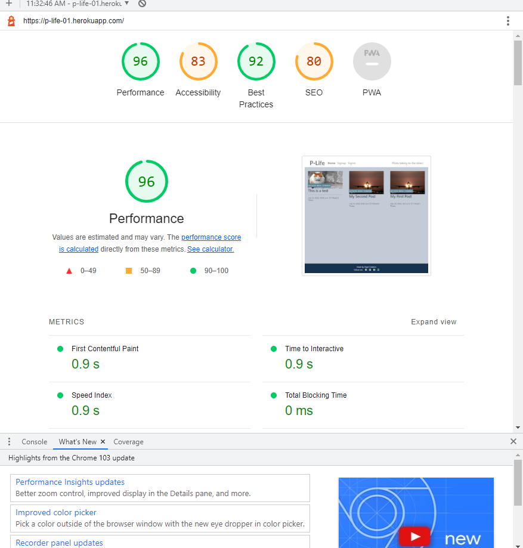

### W3C Markup Validation

- Home page

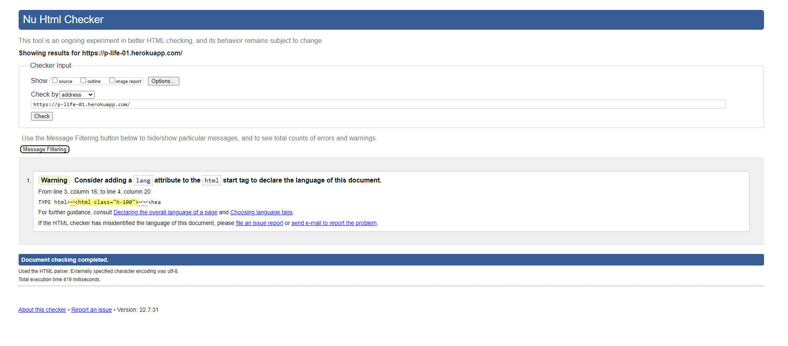

- Post detail page
    - These errors are not effecting the code running ablitiy and I ran out to time to ammend these errors.

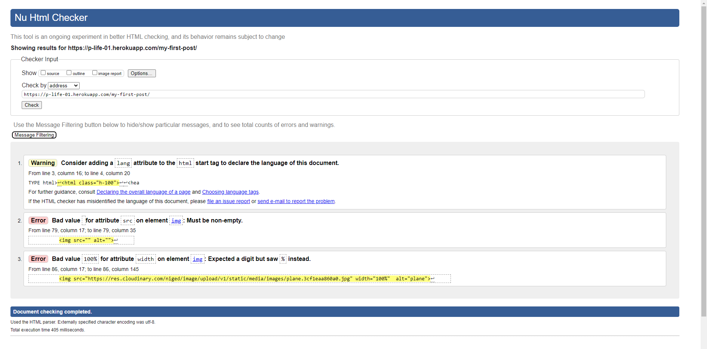

- Register Page
   - This error is not effecting the code running ablitiy and I ran out to time to ammend these errors.

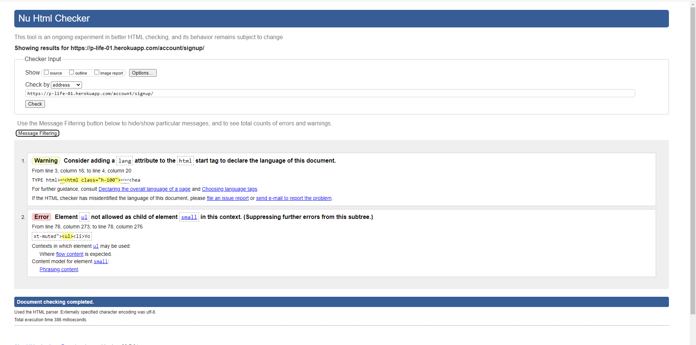

- Login Page

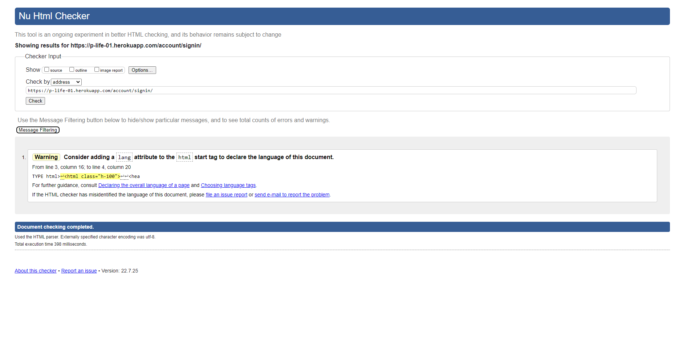

- Create Post Page
    - The test validator would not allow me to run the url from the web page directly had to use direct source code, These I believe 
      are not real issues. 

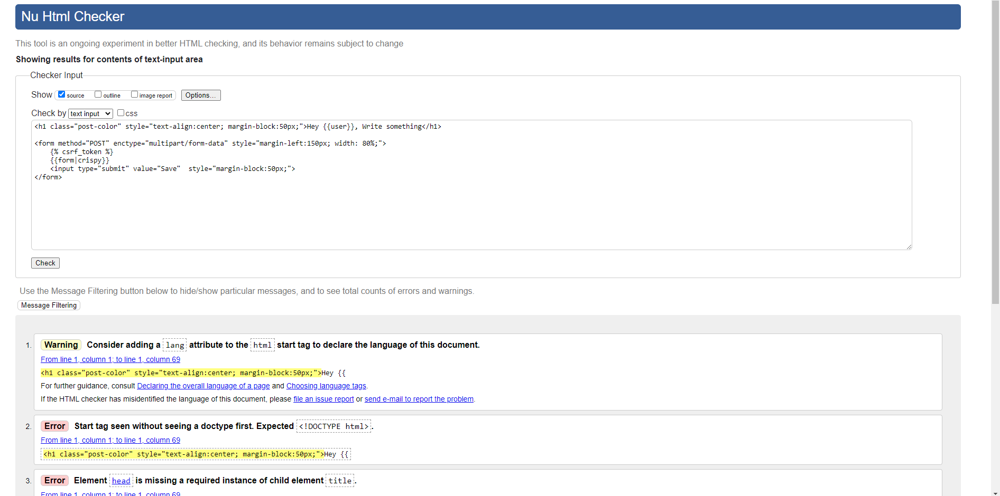

- Profile page
   - The test validator would not allow me to run the url from the web page directly had to use direct source code, These I believe 
      are not real issues.
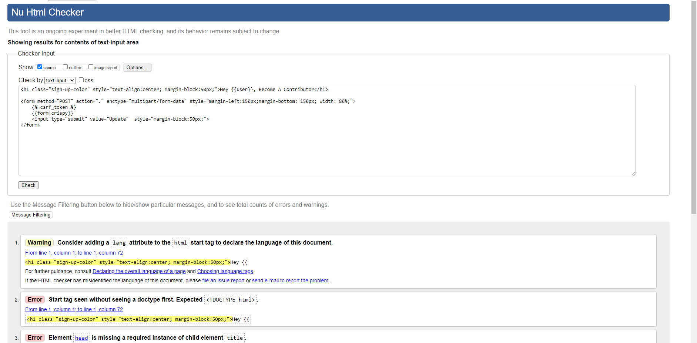

### W3C CSS Validation

- No errors or warnings found

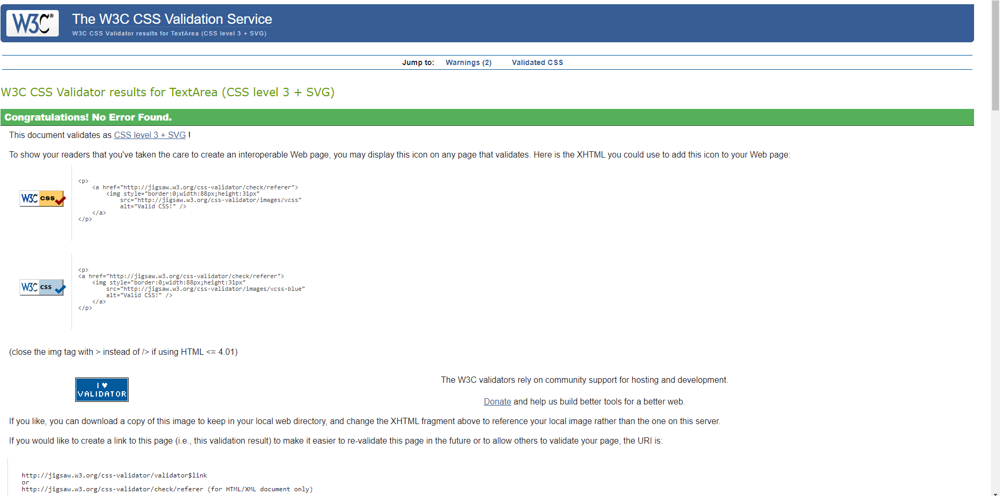

### PEP8 validation
- There are a few errors around spacing and I ran out of time to amend these. they however do not effect the running code.

- Unit testing for forms

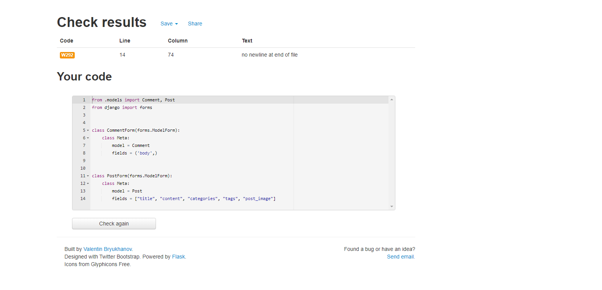

- Unit testing for views

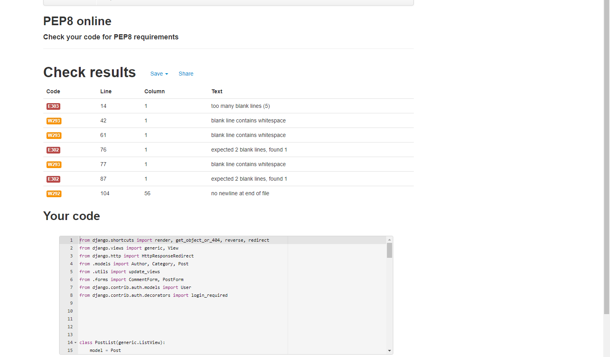

- forum app urls

- admin.py

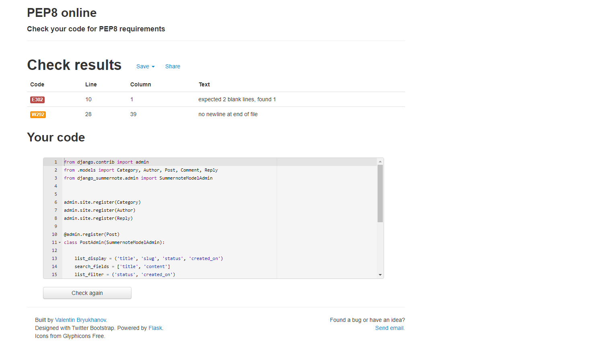

- models.py

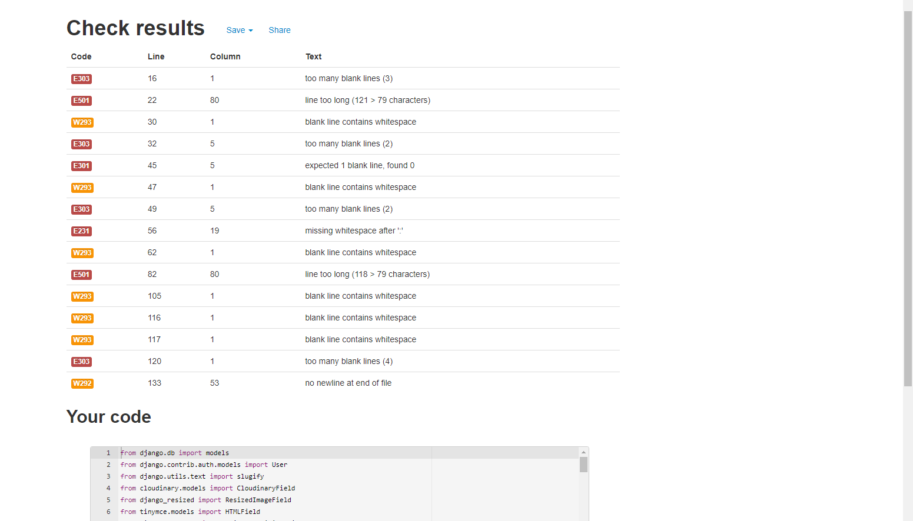

## User Story Testing

### Admin
- As Site Admin, I can approve/disapprove blogs and comments so that I can filter out objectionable Content.

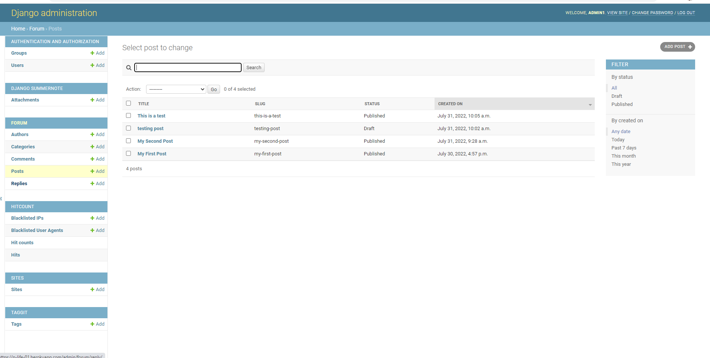

- As Site Admin I can create, post, edit or delete blogs so that I can share and manage my blogs.
- As Site Admin I can have all the functionality of a member user so that I can be involved with the blog site.

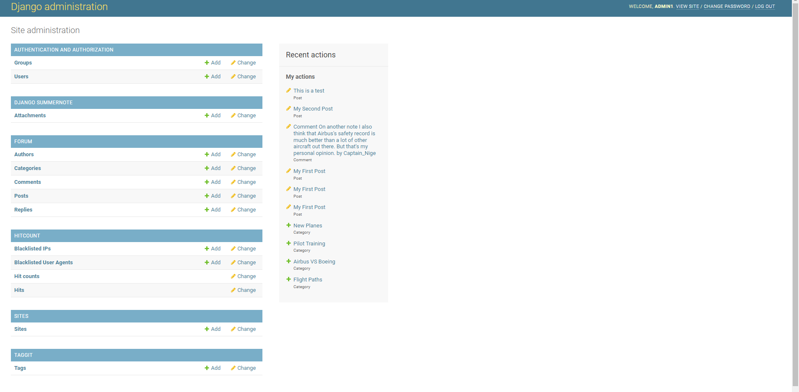

### General User

- As a general user, I can view a list of blogs so that I can select one to read.

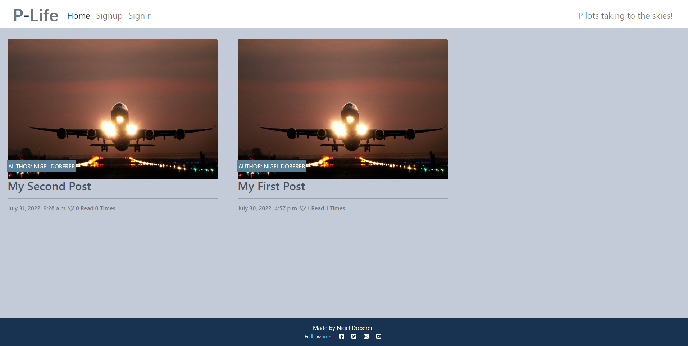

- As a general user, I can click on a blog so that I can read the whole blog.
- As a general user, I can view the number of likes on a blog, so that I can see which is most popular.
- As a general user, I can view comments on individual blogs so I can read the full conversation.

- As a general user, I can register for an account to take full member user benefits.

### Member User

- As a member user, I can create, post, edit or delete blogs so that I can share and manage my blogs.

- As a member user, I can like/unlike blogs so that I can interact with the content.
- As a member user, I can leave comments on a blog, so that I can be involved with the conversation.

## Final testing
- All pages have been tested on desktop, tablet, and mobile, links and buttons have been tested and appear satisfactory.

back to the [README.md](README.md)